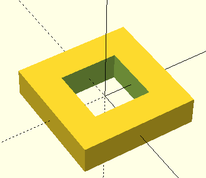

# PrimSharp

A C# library for Constructive Solid Geometry  

Objects are rendered to OpenSCAD code.  
You can paste the rendered code into OpenSCAD and use it to generate an STL file.  

## OpenSCAD

You can get OpenSCAD from here:  
<https://openscad.org/>

## Notes

Dimensions use Width, Breadth, and Height.
I went with "Breadth" instead of "Length" to avoid conflicts with the word "Length."

## Example

Running this: 

``` csharp
new Cube()
    .RotateZ(45)
    .ToOpenScad();
```

Gives you this: 

``` openscad
rotate([0, 0, 45])
cube([1, 1, 1], center=true);
```

Note that the geometry isn't translated to OpenScad until the ToOpenScad() method is called.

## Getting outputs

I usually just use unit tests to retrieve outputs for a model.  
This probably isn't the best use of tests, but it works.

``` csharp
using PrimSharp;
using Xunit;
using Xunit.Abstractions;

namespace PrimSharpTests
{
    public class BoxTests
    {
        private readonly ITestOutputHelper _outputHelper;
        public BoxTests(ITestOutputHelper outputHelper) => _outputHelper = outputHelper;

        [Fact]
        public void Box_with_defaults() =>
            _outputHelper.WriteLine(new Box().ToOpenScad());   
    }
}
```

## Primitives

Cube - a rectangular solid

``` csharp
new Cube(width: 3, breadth: 5, height: 2);
```

Cylinder - you know what a cylinder is.

``` csharp
new Cylinder(radius: 2, height: 5);
```

## Simple Operations

``` csharp
new Box(4, 4, 1).Subtract(new Box(2, 2, 1));
```




## Projects

PrimSharp - Primitives  
PrimDesign - Models created from primitives  
